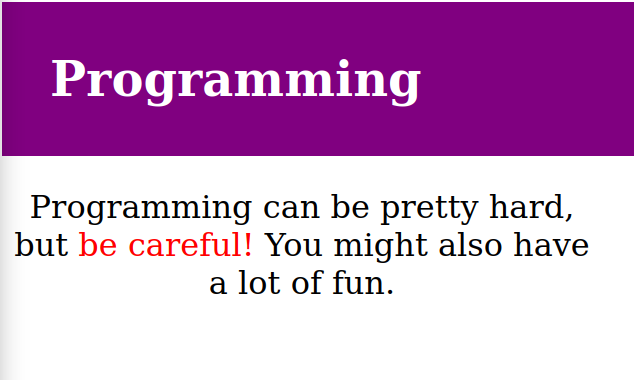

# CSS Programming Danger

Write a style sheet that does the following:

* Makes the heading white, bold, 24 pixels high, with a background color of purple and 24 pixels of space all around it
* Limits all the paragraphs to being 300 pixels wide and center all the text inside them
* Makes the text in the element with an id of "warning" red
